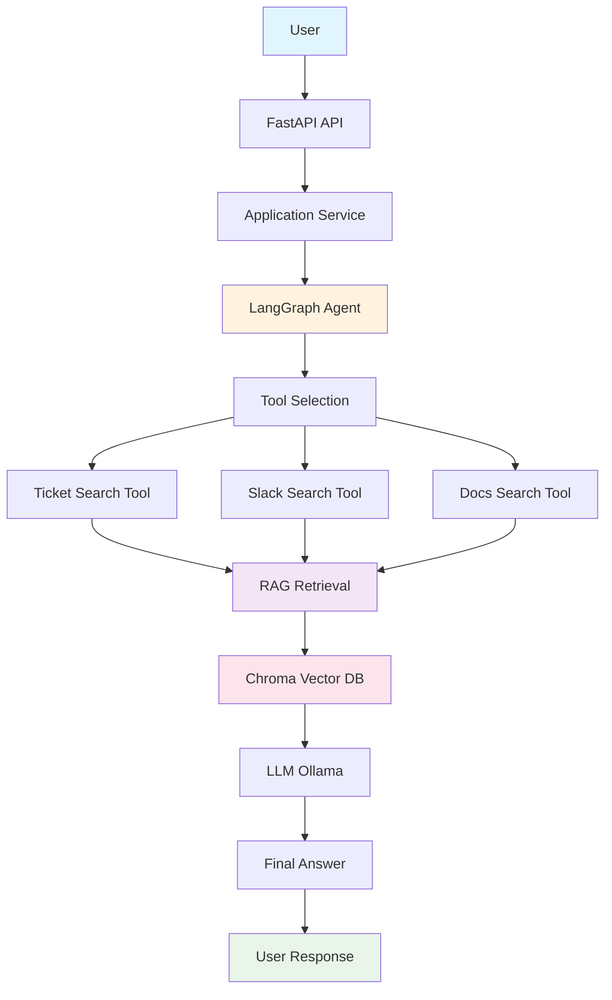
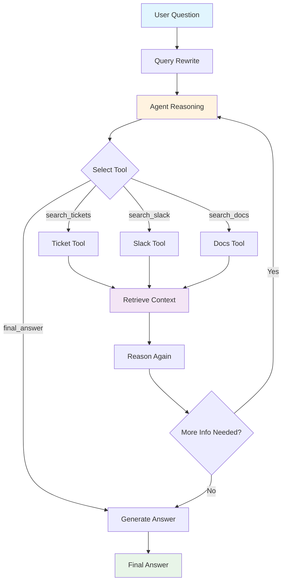
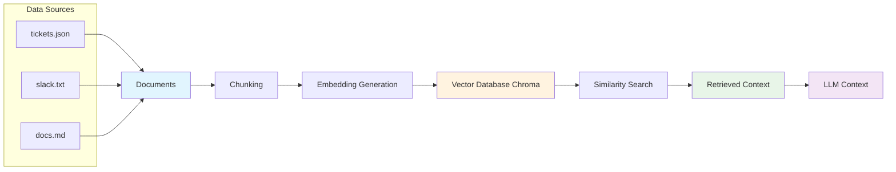
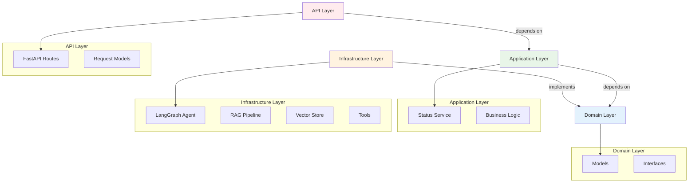
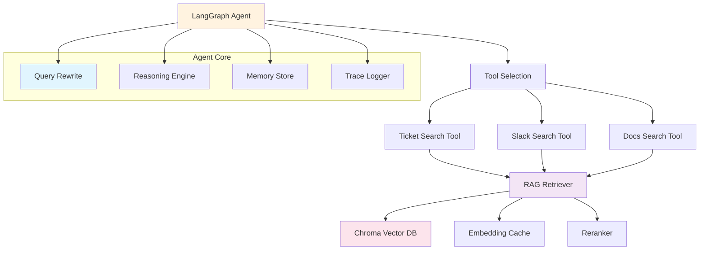

# AI Status Agent

An **agentic AI backend** that answers project status questions by retrieving information from engineering data sources such as tickets, Slack messages, and documentation.

The system uses **RAG (Retrieval Augmented Generation)** with a **LangGraph ReAct-style agent** to reason about queries, select tools, retrieve relevant information, and produce structured status summaries.

This project demonstrates **enterprise-style AI architecture**, not just an LLM wrapper.

---

# Example Query

```json
POST /query
{
  "question": "payment issue?"
}
```

Response:

```json
{
  "result": "Feature: Implement Stripe payment gateway (PAY-231), Refund processing support (PAY-245)

Status: In Progress (PAY-231), Todo (PAY-245)

Owner: Rahul (PAY-231), Maya (PAY-245)

Latest Update: unknown"
}
```

The agent interprets **business language** and maps it to **engineering work items**.

Example:

| Business question | Engineering mapping                |
| ----------------- | ---------------------------------- |
| payment issue     | Stripe gateway / refund processing |
| checkout broken   | payment service / checkout API     |
| refund problem    | refund API implementation          |

---

# System Architecture



---

# Agent Reasoning Flow



The agent decides **which tool to use** and can run multiple reasoning steps.

---

# RAG Pipeline



Data sources used in this project:

```
data/
 ├── tickets.json
 ├── slack.txt
 └── docs.md
```

---

# Agent Capabilities

### Query Rewriting

Converts user questions into **search-friendly queries**.

Example:

```
payment issue
↓
payment gateway failure status
```

---

### Tool Selection

The agent chooses tools dynamically:

```
search_tickets
search_slack
search_docs
```

---

### Retrieval Augmented Generation

Relevant information is retrieved from the vector database and passed to the LLM.

---

### Business → Engineering Mapping

The system understands that:

```
payment issue
```

could relate to:

```
payment gateway
refund system
checkout API
```

---

### Conversation Memory

The agent stores conversation history so follow-up questions work.

Example:

```
User: payment issue
Agent: Stripe gateway in progress

User: who owns it?
Agent: Rahul
```

---

### Agent Tracing

A `/trace` endpoint exposes the agent reasoning steps.

Example trace:

```
rewrite → payment gateway failure status
reason → search_tickets
tool → retrieved PAY-231
reason → final_answer
```

---

# Project Structure

```
app
│
├── api
│   └── routes
│
├── application
│   └── services
│
├── domain
│   ├── models
│   └── interfaces
│
├── infrastructure
│   ├── agents
│   │   ├── tools
│   │   ├── memory
│   │   ├── tracing
│   │   └── status_agent.py
│   │
│   ├── rag
│   │   ├── ingestion
│   │   ├── embeddings
│   │   ├── vector_store
│   │   └── retrieval
│   │
│   └── repositories
│
└── config
```

# Clean Architecture



This structure separates:

| Layer          | Responsibility         |
| -------------- | ---------------------- |
| API            | HTTP endpoints         |
| Application    | business orchestration |
| Domain         | models & interfaces    |
| Infrastructure | tools, RAG, agents     |

---

# Agent Tooling



---

# Running the Project

### Install dependencies

```bash
uv sync
```

---

### Run Ollama

```bash
ollama serve
```

Make sure a model exists:

```bash
ollama pull llama3
ollama pull nomic-embed-text
```

---

### Run ingestion pipeline

```bash
uv run python -m app.infrastructure.rag.ingestion.pipeline
```

This builds the vector database.

---

### Start the API

```bash
uv run uvicorn app.main:app --reload
```

---

# API Endpoints

### Query the agent

```
POST /query
```

Example:

```json
{
  "question": "payment issue?"
}
```

---

### View agent reasoning trace

```
GET /trace
```

Shows internal agent steps.

---

# Technologies Used

| Technology | Purpose                |
| ---------- | ---------------------- |
| FastAPI    | API layer              |
| LangGraph  | agent orchestration    |
| LangChain  | LLM integrations       |
| Ollama     | local LLM runtime      |
| ChromaDB   | vector database        |
| Python     | backend implementation |

---

# Why This Project

Many AI projects are simple **LLM wrappers**.

This project demonstrates **real AI engineering concepts**:

* Agentic AI
* RAG pipelines
* tool-based reasoning
* vector search
* enterprise architecture
* observability (trace)
* conversation memory

---

# Future Improvements

Potential enhancements:

* streaming responses
* confidence scoring
* source citations
* production vector DB (Weaviate / Pinecone)
* Slack / Jira integrations

---

