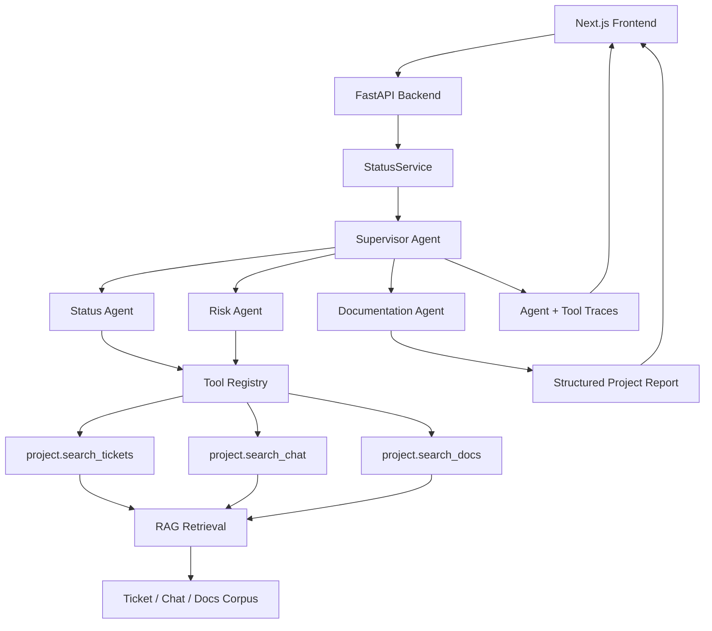

# StatusPilot AI

Multi-agent project intelligence for engineering teams.

StatusPilot AI is a SaaS-style product prototype that sits on top of Jira-like tickets, engineering chat, and project documentation to generate source-backed status reports, risk summaries, and action items.

## What It Demonstrates

- FastAPI backend architecture
- Next.js + Tailwind frontend
- Multi-agent orchestration
- MCP-ready tool registry and descriptors
- Tool calling, traces, and OpenTelemetry span hooks
- RAG-style retrieval with source attribution
- Structured Pydantic outputs
- Report generation
- Deployment-ready configuration

## Architecture


```mermaid
flowchart TD
    UI[Next.js Frontend] --> API[FastAPI Backend]
    API --> Service[StatusService]
    Service --> Supervisor[Supervisor Agent]

    Supervisor --> Status[Status Agent]
    Supervisor --> Risk[Risk Agent]
    Supervisor --> Docs[Documentation Agent]

    Status --> Registry[Tool Registry]
    Risk --> Registry
    Registry --> Tickets[project.search_tickets]
    Registry --> Chat[project.search_chat]
    Registry --> ProjectDocs[project.search_docs]

    Tickets --> Retrieval[RAG Retrieval]
    Chat --> Retrieval
    ProjectDocs --> Retrieval
    Retrieval --> Corpus[Ticket / Chat / Docs Corpus]

    Docs --> Report[Structured Project Report]
    Supervisor --> Trace[Agent + Tool Traces]
    Report --> UI
    Trace --> UI
```

## Product Pages

- Dashboard
- Agent Run
- Knowledge Base
- Reports
- Evaluations
- Settings

## Local Backend

```bash
uv sync
uv run uvicorn app.main:app --reload --port 8000
```

Backend runs on `http://localhost:8000`.

## Local Frontend

```bash
cd frontend
cp .env.example .env.local
npm install
npm run dev
```

Frontend runs on `http://localhost:3000`.

If `next: command not found`, dependencies are not installed yet. Run `npm install` first and wait for it to finish.

## Demo Query

```text
What is the current checkout launch status and risk?
```

The Agent Run page shows:

- Agent execution timeline
- Tool calls
- Retrieved sources
- Final generated report
- Confidence / quality score
- Copyable report output
- Graceful sample-data fallback when the API is unavailable

## Backend Endpoints

- `GET /health`
- `POST /agent/run`
- `GET /agent/tools`
- `GET /knowledge/sources`
- `GET /reports/demo`
- `GET /trace`
- `POST /query` legacy compatibility

## Deployment

See [Deployment Guide](docs/DEPLOYMENT.md).

Recommended Phase 1 targets:

- Frontend: Vercel
- Backend: Railway or Render
- Vector DB later: Qdrant Cloud

## Testing

```bash
uv run pytest -q
uv run ruff check app tests
```
