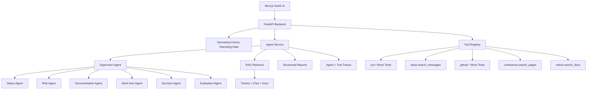
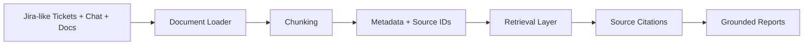

# SprintPilot.AI

AI operating briefs for engineering execution.

SprintPilot.AI is a workflow intelligence layer for founders, CEOs, product managers, engineering managers, and developers. It connects to project systems like Jira, ClickUp, Slack, GitHub, and docs, then explains what the work means.

> Jira tracks work. SprintPilot explains what the work means.

## Why It Exists

Engineering teams already have tickets, PRs, Slack updates, docs, and release notes. The hard part is turning that fragmented activity into clear operating answers:

- Are we on track?
- What is blocked?
- What changed this week?
- What needs leadership attention?
- Which owners are overloaded?
- What decisions are needed?
- What should go into the weekly update?

SprintPilot does not replace PMs. It replaces low-leverage PM work: status chasing, ticket archaeology, manual reporting, risk scanning, and weekly update writing.

## Current MVP

The current MVP includes:

- Polished Next.js SaaS frontend
- FastAPI backend
- Demo login/logout and role switching
- Founder, PM, EM, Engineer, Viewer role views
- Work Items page
- Risk Center
- Weekly Reports
- Agent Run page with traces/tool calls/sources
- Knowledge Base page
- Connectors page
- Evaluations page
- Settings / Developer Mode
- Pricing page
- Mock Jira, Slack, GitHub, Confluence, Notion, Linear connector states
- MCP-ready tool registry
- RAG-style source retrieval
- Structured report outputs
- Lightweight OpenTelemetry span hooks

## Demo Credentials

Use the Login page or role switcher in the header.

Demo users:

| Role | Name | Email |
| --- | --- | --- |
| Founder / Admin | Ananya Rao | founder@sprintpilot.ai |
| Product Manager | Maya Menon | pm@sprintpilot.ai |
| Engineering Manager | Dev Shah | em@sprintpilot.ai |
| Engineer | Rahul Iyer | engineer@sprintpilot.ai |
| Viewer | Nora Lee | viewer@sprintpilot.ai |

No password is required in the MVP. This is intentional demo auth and can later be replaced with Clerk, Supabase Auth, or NextAuth.

## Architecture


```mermaid
flowchart TD
    UI[Next.js SaaS UI] --> API[FastAPI Backend]
    API --> DemoData[Normalized Demo Operating Data]
    API --> AgentService[Agent Service]
    API --> Tools[Tool Registry]

    AgentService --> Supervisor[Supervisor Agent]
    Supervisor --> Status[Status Agent]
    Supervisor --> Risk[Risk Agent]
    Supervisor --> Docs[Documentation Agent]
    Supervisor --> WorkItem[Work Item Agent]
    Supervisor --> Decision[Decision Agent]
    Supervisor --> Eval[Evaluation Agent]

    Tools --> Jira[jira.* Mock Tools]
    Tools --> Slack[slack.search_messages]
    Tools --> GitHub[github.* Mock Tools]
    Tools --> Confluence[confluence.search_pages]
    Tools --> Notion[notion.search_docs]

    AgentService --> Retrieval[RAG Retrieval]
    Retrieval --> Sources[Tickets + Chat + Docs]
    AgentService --> Reports[Structured Reports]
    AgentService --> Traces[Agent + Tool Traces]
```

## Agent Architecture

Agents currently implemented or scaffolded:

- Supervisor Agent
- Status Agent
- Risk Agent
- Documentation Agent
- Work Item Agent
- Decision Agent
- Evaluation Agent

Agent capabilities shown in the MVP:

- Tool calling
- Source retrieval
- Structured outputs
- Source-backed reporting
- Risk classification
- Confidence scoring
- Citations
- Tool traces
- Agent traces

## MCP-Ready Tool Architecture

The MVP includes a production-shaped tool layer:

- Tool Registry
- Tool Descriptor schema
- Tool Auth Context
- Tool Execution Options
- Timeout metadata
- Retry handling
- Trace logging
- Mock tools for local/demo mode
- Real connector interface path for future production

Defined tools:

- `jira.search_issues`
- `jira.get_issue`
- `jira.get_comments`
- `jira.sync_project`
- `github.search_prs`
- `github.get_pr_status`
- `slack.search_messages`
- `confluence.search_pages`
- `notion.search_docs`
- `project.search_tickets`
- `project.search_chat`
- `project.search_docs`

## RAG Pipeline


```mermaid
flowchart LR
    Sources[Jira-like Tickets + Chat + Docs] --> Loader[Document Loader]
    Loader --> Chunker[Chunking]
    Chunker --> Metadata[Metadata + Source IDs]
    Metadata --> Retrieval[Retrieval Layer]
    Retrieval --> Citations[Source Citations]
    Citations --> Reports[Grounded Reports]
```

Current retrieval mode is demo-safe local retrieval with source attribution. Chroma support remains available through the existing vector store path.

## Evaluation Pipeline

The MVP includes practical evaluation concepts:

- Groundedness
- Hallucination check
- Retrieval relevance
- Answer faithfulness
- Citation accuracy
- Latency
- Token usage
- Cost estimate

The current implementation uses simple custom seeded evaluations first. Ragas or DeepEval can be added later if needed.

## Observability

Current observability includes:

- Structured agent traces
- Tool call records
- Retrieval traces through source citations
- Latency metrics on tool execution
- OpenTelemetry span hooks
- Error states in UI

Future production options:

- Langfuse
- Sentry
- PostHog
- Hosted OpenTelemetry collector

## Setup

Backend:

```bash
uv sync
uv run uvicorn app.main:app --reload --port 8000
```

Frontend:

```bash
cd frontend
npm install
npm run dev:clean
```

Open:

```text
http://localhost:3000
```

## Environment Variables

Backend minimum:

```env
APP_NAME="SprintPilot.AI"
ENVIRONMENT=production
LLM_PROVIDER=demo
VECTOR_PROVIDER=local
CORS_ORIGINS=https://your-vercel-url.vercel.app
```

Optional connector credentials later:

```env
JIRA_BASE_URL=
JIRA_EMAIL=
JIRA_API_TOKEN=
SLACK_BOT_TOKEN=
GITHUB_APP_ID=
GITHUB_PRIVATE_KEY=
CONFLUENCE_BASE_URL=
CONFLUENCE_API_TOKEN=
NOTION_TOKEN=
LINEAR_API_KEY=
```

Frontend:

```env
NEXT_PUBLIC_API_BASE_URL=https://your-backend-url
```

## Deployment

Frontend on Vercel:

```text
Root Directory: frontend
Framework Preset: Next.js
Install Command: npm install
Build Command: npm run build
Output Directory: leave empty
```

Backend on Railway/Render:

```text
Root Directory: .
Dockerfile: Dockerfile
Health Check: /health
```

## Screenshots

Add screenshots after deployment:

- Landing / Demo page
- Role-aware Dashboard
- Work Items
- Risk Center
- Weekly Reports
- Agent Run traces
- Connectors
- Evaluations
- Settings Developer Mode

## Testing

```bash
uv run pytest -q
uv run ruff check app tests
npm --prefix frontend run build
```

## Roadmap

See [Product Roadmap](docs/PRODUCT_ROADMAP.md).

Immediate next product work:

1. Wire dashboard/work-items/risks pages to backend APIs instead of shared frontend demo data.
2. Add real Jira read-only connector.
3. Add report history persistence.
4. Add PostgreSQL for workspaces, reports, work items, connectors, and traces.
5. Add Qdrant Cloud for production vector retrieval.
6. Replace demo auth with Clerk/Supabase/NextAuth.
7. Add scheduled weekly briefs and Slack delivery.

## Resume Bullet

Built SprintPilot.AI, a multi-agent RAG workflow with tool-calling, vector search, observability tracing, and evaluation workflows for developer-facing project analysis; architected to support MCP-based integrations with tools such as Jira and Slack.
