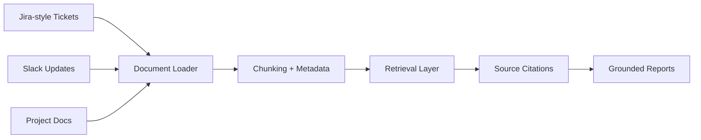

# SprintPilot.AI

> AI operating briefs for engineering execution.
> Role-differentiated intelligence for Founders, PMs, Engineering Managers, and Developers.

SprintPilot.AI turns fragmented Jira, GitHub, Slack, and docs activity into execution intelligence. Jira tracks work. SprintPilot explains what the work means.

## What It Does

SprintPilot answers the operating questions engineering leaders ask every week:

- Are we on track?
- What is blocked?
- What changed this week?
- What needs leadership attention?
- Which owners are overloaded?
- What decisions are needed?
- What should go into the weekly update?

The product is role-first. A founder sees business risk and decisions. A PM sees sprint health and report generation. An engineering manager sees team capacity and delivery confidence. A developer sees tasks, blockers, PRs, and next actions.

## Current MVP

Implemented in this repo:

- Role-aware Next.js SaaS frontend
- Email/password auth, demo OAuth callbacks, refresh-token cookies, and role routing
- Protected frontend routes with public `/demo`, `/login`, `/register`, `/pricing`, and `/auth/callback`
- Separate dashboard routes for Founder, PM, Engineering Manager, Developer, and Viewer
- Role-specific sidebar navigation
- Weekly Report generator with audience-aware language
- Work Items, Risk Center, Decisions, Priorities, Team Health, PRs, Reports, Knowledge Base, Connectors, Evaluations, Pricing, Settings
- FastAPI backend with normalized demo operating data
- MCP-compatible tool registry and discovery/execution endpoints
- Mock Jira, GitHub, Slack, Confluence, Notion, and Linear connector path
- LangGraph agentic workflow with dynamic supervisor re-routing and reflection loop
- Agentic tool registry where agents select tools from LLM-readable descriptions
- Pydantic structured output schemas
- RAG-style source retrieval with citations
- Per-workspace vector-store abstraction with local demo backend and Chroma/Qdrant-ready boundary
- Deterministic evaluation framework for groundedness, citation coverage, completeness, actionability, token use, and cost estimate
- OpenTelemetry span hooks, trace store, tool traces, and `/metrics` Prometheus-style endpoint

## Demo Credentials

Use `/login` or `/role-select`.

| Role | Email | Password |
| --- | --- | --- |
| Founder / CEO | founder@demo.sprintpilot.ai | demo123 |
| Product Manager | pm@demo.sprintpilot.ai | demo123 |
| Engineering Manager | em@demo.sprintpilot.ai | demo123 |
| Developer | dev@demo.sprintpilot.ai | demo123 |
| Viewer | viewer@demo.sprintpilot.ai | demo123 |

Password is shown for demo realism. Current auth uses FastAPI signed access tokens, backend refresh-token storage, and httpOnly refresh cookies. OAuth routes run in demo mode until Google/GitHub credentials are configured.

## Role System

| Role | Primary Question | Primary CTA | Primary Routes |
| --- | --- | --- | --- |
| Founder | Is the company executing? | Generate My Weekly Brief | `/dashboard/founder`, `/report/weekly`, `/priorities`, `/risks`, `/decisions`, `/teams` |
| Product Manager | What is the sprint state? | Generate Weekly Report | `/dashboard/pm`, `/report/weekly`, `/work-items`, `/priorities`, `/risks`, `/decisions`, `/connectors` |
| Engineering Manager | Is my team healthy? | View Team Health | `/dashboard/em`, `/work-items`, `/prs`, `/risks`, `/delivery`, `/reports` |
| Developer | What do I need to do today? | View My Tasks | `/dashboard/developer`, `/my-prs`, `/my-blockers`, `/team-tasks` |
| Viewer | What reports can I read? | Review Reports | `/reports`, `/risks`, `/report/weekly` |

## Architecture Overview

```mermaid
flowchart TD
    UI[Next.js Role-First SaaS UI] --> API[FastAPI Backend]
    API --> Store[SQLite Demo Store / Postgres-ready boundary]
    API --> Auth[Auth Service + Workspace Roles]
    API --> AgentService[Agent Service]
    API --> MCP[MCP-Compatible Tool Registry]
    API --> Eval[Evaluation Framework]
    API --> Metrics[/metrics]

    AgentService --> Supervisor[Supervisor Agent]
    Supervisor --> Reroute[Dynamic Re-Routing]
    Supervisor --> Status[Status Agent]
    Supervisor --> Risk[Risk Agent]
    Supervisor --> Decision[Decision Agent]
    Supervisor --> Impact[Business Impact Agent]
    Supervisor --> Report[Report Agent]
    Supervisor --> Evaluation[Evaluation Agent]

    MCP --> Jira[jira.* Tools]
    MCP --> GitHub[github.* Tools]
    MCP --> Slack[slack.search_messages]
    MCP --> Docs[docs.search]
    MCP --> Reports[reports.generate_weekly]

    AgentService --> Retrieval[RAG Retrieval]
    Retrieval --> Sources[Tickets + PRs + Slack + Docs]
    Sources --> Citations[Source Citations]
    Evaluation --> Reflection[Reflection Loop]
    Reflection --> Retrieval
```

## Agent System

Backend modules demonstrate production agentic architecture without requiring external credentials for local demo mode.

- `app/infrastructure/agents/supervisor_agent.py`: existing multi-agent orchestration service used by `/agent/run`
- `app/infrastructure/agents/graph.py`: LangGraph workflow with supervisor re-planning, dynamic re-routing, and evaluation loopback
- `app/infrastructure/agents/state.py`: typed `AgentState` carrying execution memory
- `app/infrastructure/agents/agentic_tool_registry.py`: LLM-readable tool registry for autonomous tool selection
- `app/infrastructure/agents/status_agent.py`: sprint and ticket status extraction
- `app/infrastructure/agents/risk_agent.py`: blocker and risk detection
- `app/infrastructure/agents/decision_agent.py`: decision extraction scaffold
- `app/infrastructure/agents/work_item_agent.py`: work item insight scaffold
- `app/infrastructure/agents/evaluation_agent.py`: quality scoring scaffold
- `app/infrastructure/evaluation/evaluator.py`: deterministic report evaluator

Workflow stages:

```text
supervisor -> retrieve -> supervisor -> status -> supervisor -> risk -> supervisor -> decision? -> impact -> action -> report -> evaluate -> retrieve? -> END
```

Agentic properties implemented:

- Dynamic re-routing: supervisor inspects intermediate state after every node and inserts `decision` when critical risk appears.
- Tool-calling autonomy: status, risk, retrieval, and report nodes choose tools from the agentic registry based on state and tool descriptions.
- Reflection loop: evaluation can reject output and route back to retrieval with a stronger query up to two times.

## MCP-Compatible Tool Registry

Tool discovery:

```bash
curl http://localhost:8000/mcp/tools
```

Tool execution:

```bash
curl -X POST http://localhost:8000/mcp/tools/jira.search_blocked/execute \
  -H "Content-Type: application/json" \
  -d '{"inputs": {}}'
```

Registered tool families:

- `jira.search_issues`
- `jira.get_issue`
- `jira.get_comments`
- `jira.get_sprint_tickets`
- `jira.search_blocked`
- `jira.search_stale`
- `jira.get_owner_workload`
- `jira.sync_project`
- `github.search_prs`
- `github.get_pr_list`
- `github.get_pr_delays`
- `github.get_pr_status`
- `slack.search_messages`
- `confluence.search_pages`
- `notion.search_docs`
- `docs.search`
- `reports.generate_weekly`
- `risks.detect`
- `decisions.extract`
- `project.search_tickets`
- `project.search_chat`
- `project.search_docs`

Agentic graph tools:

- `jira.get_sprint_tickets`
- `jira.get_blocked_tickets`
- `github.get_stale_prs`
- `slack.search_messages`
- `vector.semantic_search`
- `analysis.detect_capacity_overload`
- `analysis.compute_sprint_health`
- `reports.generate_role_brief`

## RAG Pipeline


```mermaid
flowchart LR
    Tickets[Jira-style Tickets] --> Loader[Document Loader]
    Slack[Slack Updates] --> Loader
    Docs[Project Docs] --> Loader
    Loader --> Chunker[Chunking + Metadata]
    Chunker --> Retriever[Retrieval Layer]
    Retriever --> Citations[Source Citations]
    Citations --> Reports[Grounded Reports]
```

Current local mode uses deterministic retrieval over seeded tickets, Slack-style updates, and docs. Chroma support remains in the repository; Qdrant can be added behind the same retrieval boundary.

Additional RAG modules:

- `app/infrastructure/rag/vector_store/workspace_store.py`
- `app/infrastructure/rag/ingestion/workspace_pipeline.py`

These provide per-workspace collection naming, local deterministic search, Chroma/Qdrant-ready backend selection, and Jira/GitHub/Slack ingestion into source-attributed documents.

## Structured Outputs

Structured models live in:

- `app/domain/models/operating.py`
- `app/domain/models/agent_outputs.py`

Core output types include:

- `WeeklyReportOutput`
- `EvaluationResult`
- `RiskOutputItem`
- `DecisionOutputItem`
- `WorkItemInsight`
- `TeamHealth`
- `BusinessImpact`
- `AgentTrace`

## Evaluation Framework

The evaluator scores generated reports across:

- Groundedness
- Citation coverage
- Hallucination risk
- Retrieval relevance
- Completeness
- Actionability
- Latency
- Token usage
- Cost estimate

The UI translates these into business language such as “Sources checked” and “Claims verified.”

## Observability

Implemented:

- Agent traces
- Tool call records
- OpenTelemetry span hooks
- Retrieval/source traces
- Latency metadata
- Token/cost estimates
- `/metrics` endpoint
- Agent run event tracer
- WebSocket-ready route at `/ws/agent-run/{workspace_id}`

Metrics endpoint:

```bash
curl http://localhost:8000/metrics
```

## Backend APIs

Primary product APIs:

```text
GET  /api/dashboard/{role}
POST /api/reports/weekly/generate
GET  /api/reports/weekly/history
GET  /api/risks
GET  /api/decisions
GET  /api/work-items
GET  /api/teams
GET  /api/priorities
GET  /api/prs
GET  /api/sprints/current
POST /api/auth/register
POST /api/auth/login
POST /api/auth/refresh
POST /api/auth/logout
GET  /api/auth/oauth/{provider}
GET  /api/users/me
POST /api/agentic/run
GET  /api/agent-runs
GET  /api/agent-runs/{run_id}
WS   /ws/agent-run/{workspace_id}
GET  /mcp/tools
POST /mcp/tools/{tool_name}/execute
GET  /metrics
```

Existing demo endpoints such as `/agent/run`, `/reports`, `/connectors`, `/evaluations/summary`, and `/knowledge/sources` remain available.

## Connectors

Connector architecture is production-shaped but mock-safe in Phase 1.

- `app/infrastructure/connectors/base.py`
- `app/infrastructure/connectors/jira.py`
- `app/infrastructure/connectors/github.py`

Phase 1 behavior:

- Missing credentials return mock/demo state
- Real credentials can later be passed through environment variables
- Sync returns normalized counts and can feed ingestion
- Secrets are not hardcoded

## Tech Stack

```text
Backend:       FastAPI · Pydantic · SQLite demo store · Docker
AI:            LangGraph · LangChain-style retrieval · Structured Outputs
Retrieval:     Local retrieval · Chroma-ready path · citation metadata
Agents:        Multi-agent workflow · tool calling · MCP-compatible registry
Evaluation:    Custom evaluator · groundedness · citation coverage · hallucination risk
Observability: OpenTelemetry hooks · structured traces · Prometheus-style metrics
Connectors:    Jira interface · GitHub interface · Slack/Docs tool abstractions
Frontend:      Next.js · TypeScript · Tailwind CSS · Lucide icons
Auth:          Demo role auth, NextAuth/Clerk/Supabase-ready boundary
Deployment:    Vercel frontend · Railway/Render backend · Docker
```

## Local Setup

Backend:

```bash
uv sync
uv run uvicorn app.main:app --reload --port 8000
```

Frontend:

```bash
cd frontend
npm install
npm run dev
```

Open:

```text
http://localhost:3000
```

If Next has stale cache locally:

```bash
cd frontend
npm run dev:clean
```

## Environment Variables

Copy `.env.example` and configure only what you need. Demo mode works without external API keys.

Frontend:

```env
NEXT_PUBLIC_API_BASE_URL=http://localhost:8000
```

Backend minimum:

```env
APP_NAME="SprintPilot.AI"
ENVIRONMENT=local
LLM_PROVIDER=demo
VECTOR_PROVIDER=local
CORS_ORIGINS=http://localhost:3000
```

## Deployment

Frontend on Vercel:

```text
Root Directory: frontend
Framework Preset: Next.js
Install Command: npm install
Build Command: npm run build
Output Directory: leave empty
```

Backend on Railway or Render:

```text
Root Directory: .
Dockerfile: Dockerfile
Health Check: /health
```

Set frontend env:

```env
NEXT_PUBLIC_API_BASE_URL=https://your-backend-url
```

Set backend env:

```env
ENVIRONMENT=production
LLM_PROVIDER=demo
VECTOR_PROVIDER=local
CORS_ORIGINS=https://your-vercel-url.vercel.app
```

## Testing

```bash
uv run pytest -q
uv run ruff check app tests
npm --prefix frontend run build
```

## Roadmap

See [Product Roadmap](docs/PRODUCT_ROADMAP.md).

Near-term production upgrades:

1. Replace demo auth with NextAuth, Clerk, or Supabase.
2. Move SQLite demo store to PostgreSQL with SQLAlchemy and Alembic.
3. Add real Jira read-only sync and ingestion.
4. Add GitHub PR sync using repo token or GitHub App.
5. Add Qdrant Cloud behind retrieval interface.
6. Persist agent runs, tool calls, evaluations, and reports in relational tables.
7. Add scheduled weekly briefs and Slack delivery.
8. Add screenshots after final public deployment.

## Resume Bullet

Built SprintPilot.AI, a role-aware multi-agent RAG workflow platform for engineering execution intelligence, with MCP-compatible tool calling, source-backed weekly reports, evaluation scoring, observability traces, and connector-ready architecture for Jira, GitHub, and Slack.
